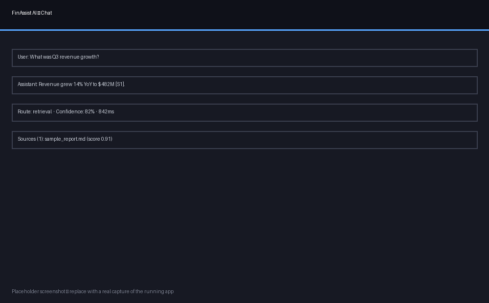

# FinAssist AI

A production-style AI application demonstrating Retrieval-Augmented
Generation (RAG), the Model Context Protocol (MCP), LLM integration,
vector databases, an autonomous agent, and an evaluation pipeline — built
end-to-end with FastAPI, LangChain/LangGraph, ChromaDB, and Streamlit.



## Features

- 🔐 **Auth** — register/login, password hashing, session tokens, persistent chat history (SQLite).
- 📄 **Document upload** — PDF, DOCX, TXT, Markdown, with text cleaning and heading detection.
- 🔎 **RAG pipeline** — recursive or semantic chunking → SentenceTransformers embeddings (swappable model) → persistent ChromaDB → similarity/MMR retrieval with metadata filtering → cited, grounded answers with a confidence score.
- 🧰 **MCP tools** — stock price (Yahoo Finance), company financials (Alpha Vantage), currency converter (ExchangeRate-API), news search (NewsAPI), calculator, date/time — schema-validated, retried, logged, and runnable as a real standalone MCP server.
- 🤖 **LangGraph agent** — routes each question to retrieval, tool calls, a direct answer, or a hybrid, then synthesizes the final response.
- 📊 **Evaluation framework** — retrieval precision/recall, latency, a hallucination-rate proxy, context relevance, and answer relevance, against a golden Q&A dataset; results persisted to SQLite.
- 🖥️ **Admin dashboard** — documents uploaded, embedding count, query volume, average latency/retrieval score/evaluation scores, with charts, inside the Streamlit app.
- 🧪 **Tests** — pytest unit tests (loader, chunker, MCP tools, retriever, prompt builder, evaluator, database) and integration tests against the live FastAPI app.
- 🐳 **Docker** — one-command startup via Docker Compose.
- ⚙️ **CI** — GitHub Actions workflow running lint (ruff) and tests with coverage on every push.

## Tech stack

| Layer | Choice |
|---|---|
| Backend | Python 3.12, FastAPI, Uvicorn |
| Orchestration | LangChain, LangGraph |
| Vector DB | ChromaDB (persistent) |
| Embeddings | SentenceTransformers (`BAAI/bge-base-en-v1.5`, swappable) |
| LLMs | OpenAI or Anthropic — switchable via `.env`, no code changes |
| Frontend | Streamlit |
| Persistence | SQLite (auth, chat history, documents, queries, evaluations) |
| Packaging | Docker, Docker Compose |
| CI | GitHub Actions |

## Quickstart

```bash
python -m venv .venv && source .venv/bin/activate
pip install -r requirements.txt
cp .env.example .env   # add ANTHROPIC_API_KEY or OPENAI_API_KEY

uvicorn backend.main:app --reload
# in a second terminal:
streamlit run frontend/app.py
```

Open http://localhost:8501, register an account, log in, upload
`data/sample_docs/sample_report.md`, and ask:

- *"What was Q3 revenue growth?"* → routes to **retrieval**
- *"What's the current price of AAPL?"* → routes to **tool**
- *"Convert 500 USD to PKR"* → routes to **tool**
- *"Hi, what can you help me with?"* → routes to **direct**

Then open the **Admin Dashboard** tab and click **Run evaluation now** to
populate the evaluation charts.

## Docker

```bash
cp .env.example .env
docker compose -f docker/docker-compose.yml up --build
```

Backend: http://localhost:8000/docs · Frontend: http://localhost:8501

## Tests

```bash
pytest --cov=backend --cov-report=term-missing tests/
```

## Documentation

- [Architecture](docs/ARCHITECTURE.md) — component breakdown + system diagram
- [Installation Guide](docs/INSTALLATION.md)
- [Deployment Guide](docs/DEPLOYMENT.md)
- [API Documentation](docs/API.md)
- [Screenshots](docs/screenshots/) *(placeholders — swap in real captures once you run it locally)*

## Project layout

```
backend/
  config.py            # pydantic-settings, env-driven config
  main.py               # FastAPI app
  api/routes.py          # auth, upload, chat, history, documents, evaluate, metrics, health
  models/schemas.py      # shared request/response models
  database/db.py         # SQLite: users, sessions, chat history, documents, queries, evaluations
  rag/                    # loader, chunker, embeddings, vectorstore, retriever, prompt, pipeline
  mcp/                    # base.py + tools/ (stock_price, financials, currency, news, calculator, datetime) + server.py
  agent/                  # LangGraph state + graph + langchain tool wrappers
  llm/client.py           # OpenAI/Anthropic switch
  evaluation/             # dataset.py + evaluator.py
frontend/app.py          # Streamlit: login, chat, upload, admin dashboard
tests/                    # pytest unit + integration tests
docs/                     # architecture, installation, deployment, API docs, screenshots
docker/                   # Dockerfile + docker-compose.yml
.github/workflows/ci.yml # lint + test on push
data/sample_docs/         # sample document for testing ingestion
```

## License

MIT — see [LICENSE](LICENSE).
