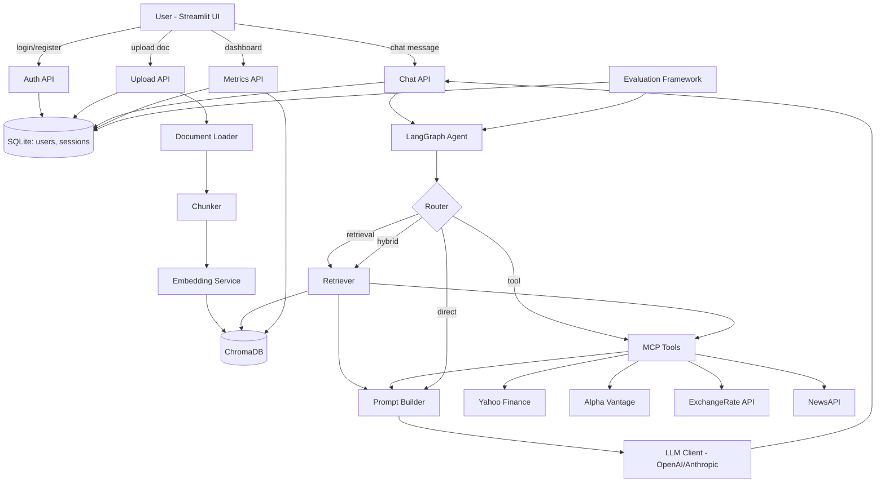

# Architecture

## Overview

FinAssist AI is a Retrieval-Augmented Generation (RAG) financial research
assistant built around three pillars: a document-grounded RAG pipeline, a
set of Model Context Protocol (MCP) financial tools, and a LangGraph agent
that decides which of those to use per question. Everything sits behind a
FastAPI backend with SQLite-backed auth, chat history, and analytics, and a
Streamlit frontend for chat, uploads, and an admin dashboard.

## System diagram

## Components

### RAG pipeline (`backend/rag/`)
`DocumentLoader` extracts and cleans text from PDF/DOCX/TXT/MD files and
detects headings. `Chunker` (recursive or semantic) splits that text into
overlapping chunks. `EmbeddingService` wraps SentenceTransformers
(`BAAI/bge-base-en-v1.5` by default) to embed chunks and queries.
`VectorStore` persists embeddings in ChromaDB and supports add/update/delete.
`Retriever` supports similarity and MMR search with metadata filtering.
`PromptBuilder` assembles the final LLM prompt from system instructions,
retrieved context (tagged `[S1]`, `[S2]`, ...), conversation history, and
the question. `RAGPipeline` orchestrates ingestion and answering end-to-end.

### MCP tools (`backend/mcp/`)
Each tool (`stock_price`, `company_financials`, `currency_converter`,
`news_search`, `calculator`, `datetime`) extends `BaseTool`, which handles
Pydantic schema validation, timing, structured logging, and error capture
uniformly. Tools are exposed two ways: as LangChain `StructuredTool`s bound
to the agent's LLM for automatic tool-calling, and as a standalone MCP
server (`backend/mcp/server.py`) any MCP client can connect to.

### Agent (`backend/agent/`)
A LangGraph `StateGraph` with a `route` node (LLM classifies the question
as `retrieval` / `tool` / `direct` / `hybrid`), a `retrieve` node, a
`call_tools` node, and a `generate` node that synthesizes the final answer
with a confidence score.

### Evaluation framework (`backend/evaluation/`)
Runs a golden Q&A dataset (`dataset.py`) through the agent and scores each
answer on retrieval precision/recall (against known-relevant documents),
latency, a hallucination-rate proxy (fraction of substantive sentences
lacking an inline citation), context relevance (average retrieval score),
and answer relevance (embedding cosine similarity between question and
answer). Results are persisted to SQLite and surfaced on the admin
dashboard.

### Auth & persistence (`backend/database/`)
A lightweight SQLite layer (PBKDF2-hashed passwords, opaque session
tokens) backs login/register, chat history, document records, per-query
analytics, and evaluation results — enough for a demo/portfolio deployment
without pulling in a separate auth service.

### API (`backend/api/routes.py`)
`POST /auth/register`, `POST /auth/login`, `POST /upload`, `POST /chat`,
`GET /history/{session_id}`, `DELETE /documents`, `GET /health`,
`POST /evaluate`, `GET /metrics`.

### Frontend (`frontend/app.py`)
Streamlit app with a login/register screen, a chat tab (upload, sources,
tool-call inspection, confidence meter), and an admin dashboard tab
(usage metrics, charts, on-demand evaluation runs).
